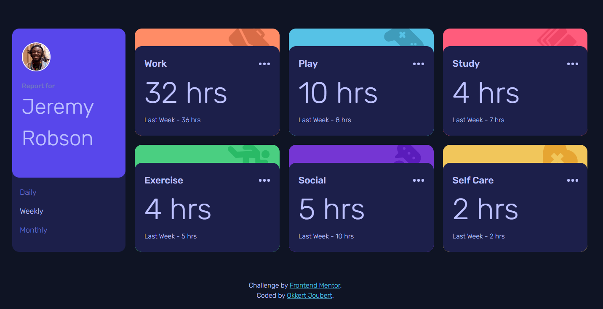
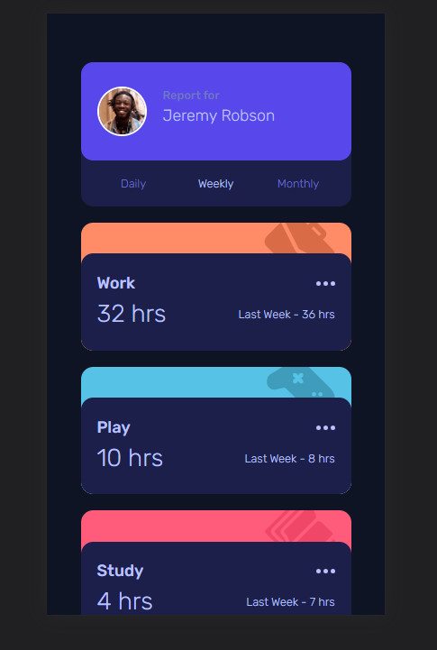

# Frontend Mentor - Time tracking dashboard solution

This is a solution to the [Time tracking dashboard challenge on Frontend Mentor](https://www.frontendmentor.io/challenges/time-tracking-dashboard-UIQ7167Jw). Frontend Mentor challenges help you improve your coding skills by building realistic projects.

## Table of contents

- [Overview](#overview)
  - [The challenge](#the-challenge)
  - [Screenshot](#screenshot)
  - [Links](#links)
- [My process](#my-process)
  - [Built with](#built-with)
  - [What I learned](#what-i-learned)
  - [Continued development](#continued-development)
- [Author](#author)

## Overview

### The challenge

Users should be able to:

- View the optimal layout for the site depending on their device's screen size
- See hover states for all interactive elements on the page
- Switch between viewing Daily, Weekly, and Monthly stats

### Screenshot




### Links

- Solution URL: [https://www.frontendmentor.io/solutions/time-tracking-dashboard-9TKidYg_8_]
- Live Site URL: [https://time-tracking-dashboard-lovat-three.vercel.app/]

## My process

### Built with

- Semantic HTML5 markup
- CSS custom properties
- Flexbox
- CSS Grid
- Mobile-first workflow

### What I learned

Using json data to update the info seen on the screen and to iterate through the data for the current data to be displayed with the correct element.
Hover is very easy to used but hovering on element inside a hover container was challenging for a while
Using the css pseudo class :has was a first

```css
.container:has(.menu:hover) {
  background-color: var(--dark-blue);
}

.menu:hover {
  cursor: pointer;
}

.container:hover {
  background-color: var(--desaturated-blue);
  cursor: pointer;
  transition: background-color 0.5s ease;
}
```

```js
const monthlyHours = async();
```

### Continued development

I tried to make the site more suitable for screen readers and keyboard users, but there is room for improvement

## Author

- Frontend Mentor - [@Okkie14](https://www.frontendmentor.io/profile/Okkie14)
